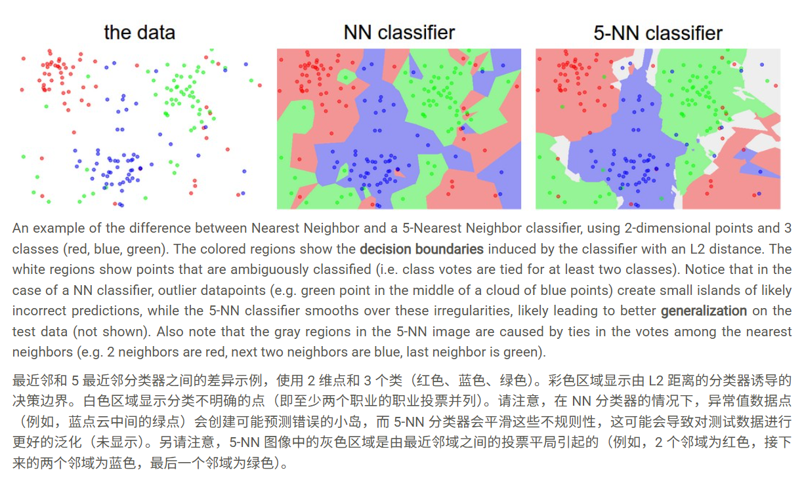

# lecture2

主要内容源于CS231n：[CS231n 用于计算机视觉的深度学习](https://cs231n.github.io/classification/)

介绍了NN和KNN，虽然正确率低下、没什么实用价值，但易于让小白理解训练集、验证集、测试集、交叉验证、损失函数L1和L2的基础概念

* NN原理
* L1和L2 距离
* K-NN原理
* 验证集的引入
* 交叉验证
* 项目演练

##  NN（Nearest Nerghbor)原理

假设训练集已标注好标签（dogs，cats，cars等），在分类任务中

不需要训练时间，在推理过程每个测试集，需要遍历所有训练集考察距离（L1或L2距离）选择最邻近的那个图像的标签

> Suppose now that we are given the CIFAR-10 training set of 50,000 images (5,000 images for every one of the labels), and we wish to label the remaining 10,000. The nearest neighbor classifier will take a test image, compare it to every single one of the training images, and predict the label of the closest training image. In the image above and on the right you can see an example result of such a procedure for 10 example test images. Notice that in only about 3 out of 10 examples an image of the same class is retrieved, while in the other 7 examples this is not the case. For example, in the 8th row the nearest training image to the horse head is a red car, presumably due to the strong black background. As a result, this image of a horse would in this case be mislabeled as a car.
> 假设现在我们获得了 50,000 张图像的 CIFAR-10 训练集（每个标签 5,000 张图像），我们希望标记剩余的 10,000 张图像。最近邻分类器将获取测试图像，将其与每个训练图像进行比较，并预测最近的训练图像的标签。在上图和右侧，您可以看到 10 个示例测试图像的此类过程的示例结果。请注意，在 10 个示例中，只有大约 3 个检索了同一类的图像，而在其他 7 个示例中，情况并非如此。例如，在第 8 行中，离马头最近的训练图像是一辆红色汽车，这可能是由于强烈的黑色背景。因此，在这种情况下，这张马的图像会被错误地标记为汽车

##  L1和L2距离

**L1 distance**

$$
d_1(I_1, I_2) = \sum_p |I_1^p - I_2^p|
$$

**L2 distance**
$$
d_2(I_1, I_2) = \sqrt{\sum_p (I_1^p - I_2^p)^2}
$$
**L1 vs. L2**

> **L1 vs. L2.** It is interesting to consider differences between the two metrics. In particular, the L2 distance is much more unforgiving than the L1 distance when it comes to differences between two vectors. That is, the L2 distance prefers many medium disagreements to one big one. L1 and L2 distances (or equivalently the L1/L2 norms of the differences between a pair of images) are the most commonly used special cases of a [p-norm](https://planetmath.org/vectorpnorm).
> L1 与 L2。考虑这两个指标之间的差异是很有趣的。特别是，当涉及到两个向量之间的差异时，L2 距离比 L1 距离要宽容得多。也就是说，L2 距离更喜欢许多中等的不一致，而不是一个大的不一致。L1 和 L2 距离（或等效于一对图像之间差值的 L1/L2 范数）是 p 范数最常用的特殊情况。

举个例子：

向量 A：`[0, 0, 0]`

向量 B1：`[10, 0, 0]` （一个位置差异很大）

向量 B2：`[3.33, 3.33, 3.33]`（三个位置差异中等）

对 A vs. B1：

- L1 距离：`|10| + |0| + |0| = 10`
- L2 距离：`√(10² + 0 + 0) = 10`

对 A vs. B2：

- L1 距离：`|3.33| * 3 ≈ 9.99`
- L2 距离：`√(3.33² * 3) ≈ √(33.3) ≈ 5.77`

L1 尖锐且鲁棒，L2 平均且平滑，易受局部影响

##  KNN（k-Nearest Neighbor）原理

> You may have noticed that it is strange to only use the label of the nearest image when we wish to make a prediction. Indeed, it is almost always the case that one can do better by using what’s called a **k-Nearest Neighbor Classifier**. The idea is very simple: instead of finding the single closest image in the training set, we will find the top **k** closest images, and have them vote on the label of the test image. In particular, when *k = 1*, we recover the Nearest Neighbor classifier. Intuitively, higher values of **k** have a smoothing effect that makes the classifier more resistant to outliers:
> 你可能已经注意到，当我们想进行预测时，只使用最近图像的标签是很奇怪的。事实上，几乎总是通过使用所谓的 k 最近邻分类器可以做得更好。这个想法非常简单：我们不是在训练集中找到最接近的单个图像，而是找到前 k 个最近的图像，并让它们对测试图像的标签进行投票。特别是，当 k = 1 时，我们恢复 Nearest Neighbor 分类器。直观地说，较高的 k 值具有平滑效果，使分类器更能抵抗异常值：

> It is worth considering some advantages and drawbacks of the Nearest Neighbor classifier. Clearly, one advantage is that it is very simple to implement and understand. Additionally, the classifier takes no time to train, since all that is required is to store and possibly index the training data. However, we pay that computational cost at test time, since classifying a test example requires a comparison to every single training example. This is backwards, since in practice we often care about the test time efficiency much more than the efficiency at training time. In fact, the deep neural networks we will develop later in this class shift this tradeoff to the other extreme: They are very expensive to train, but once the training is finished it is very cheap to classify a new test example. This mode of operation is much more desirable in practice.
> 值得考虑 Nearest Neighbor 分类器的一些优点和缺点。显然，一个优点是它非常易于实现和理解。此外，分类器不需要时间进行训练，因为所需要做的就是存储训练数据并可能为其编制索引。但是，我们在测试时支付该计算成本，因为对测试示例进行分类需要与每个训练示例进行比较。这是倒退的，因为在实践中，我们通常更关心测试时间的效率，而不是训练时的效率。事实上，我们将在本课程后面开发的深度神经网络将这种权衡转移到另一个极端：它们的训练成本非常高，但是一旦训练完成，对新的测试示例进行分类就非常便宜。这种作模式在实践中更可取。

## Validation sets（验证集） for Hyperparameter（超参数） tuning

> Luckily, there is a correct way of tuning the hyperparameters and it does not touch the test set at all. The idea is to split our training set in two: a slightly smaller training set, and what we call a **validation set**. Using CIFAR-10 as an example, we could for example use 49,000 of the training images for training, and leave 1,000 aside for validation. This validation set is essentially used as a fake test set to tune the hyper-parameters.
> 幸运的是，有一种正确的方法来调整超参数，它根本不触及测试集。这个想法是将我们的训练集一分为二：一个稍小的训练集，以及我们所说的验证集。以 CIFAR-10 为例，例如，我们可以使用 49000 张训练图像进行训练，并留出 1000 张用于验证。此验证集本质上用作模拟测试集来调整超参数。

###  **Cross-validation**(交叉验证)

> **Cross-validation**. In cases where the size of your training data (and therefore also the validation data) might be small, people sometimes use a more sophisticated technique for hyperparameter tuning called **cross-validation**. Working with our previous example, the idea is that instead of arbitrarily picking the first 1000 datapoints to be the validation set and rest training set, you can get a better and less noisy estimate of how well a certain value of *k* works by iterating over different validation sets and averaging the performance across these. For example, in 5-fold cross-validation, we would split the training data into 5 equal folds, use 4 of them for training, and 1 for validation. We would then iterate over which fold is the validation fold, evaluate the performance, and finally average the performance across the different folds.
> 交叉验证。在训练数据（以及验证数据）的大小可能很小的情况下，人们有时会使用一种更复杂的技术进行超参数优化，称为交叉验证。使用前面的示例，我们的想法是，通过迭代不同的验证集并平均这些验证集的性能，您可以更好、更少地估计 k 的某个值的工作情况，而不是武断地选择前 1000 个数据点作为验证集和 REST 训练集。例如，在 5 折交叉验证中，我们会将训练数据分成 5 个相等的折叠，其中 4 个用于训练，1 个用于验证。然后，我们将迭代哪个折叠是验证折叠，评估性能，最后平均不同折叠的性能。

> **In practice**. In practice, people prefer to avoid cross-validation in favor of having a single validation split, since cross-validation can be computationally expensive. The splits people tend to use is between 50%-90% of the training data for training and rest for validation. However, this depends on multiple factors: For example if the number of hyperparameters is large you may prefer to use bigger validation splits. If the number of examples in the validation set is small (perhaps only a few hundred or so), it is safer to use cross-validation. Typical number of folds you can see in practice would be 3-fold, 5-fold or 10-fold cross-validation.
> 在实践中。在实践中，人们更愿意避免交叉验证，而倾向于使用单个验证拆分，因为交叉验证的计算成本可能很高。人们倾向于使用的 splits 是 50%-90% 的训练数据用于训练，其余部分用于验证。但是，这取决于多个因素：例如，如果超参数的数量很大，您可能更喜欢使用更大的验证拆分。如果验证集中的示例数量很少（可能只有几百个左右），则使用交叉验证会更安全。您在实践中可以看到的典型折叠数是 3 倍、5 倍或 10 倍交叉验证。

