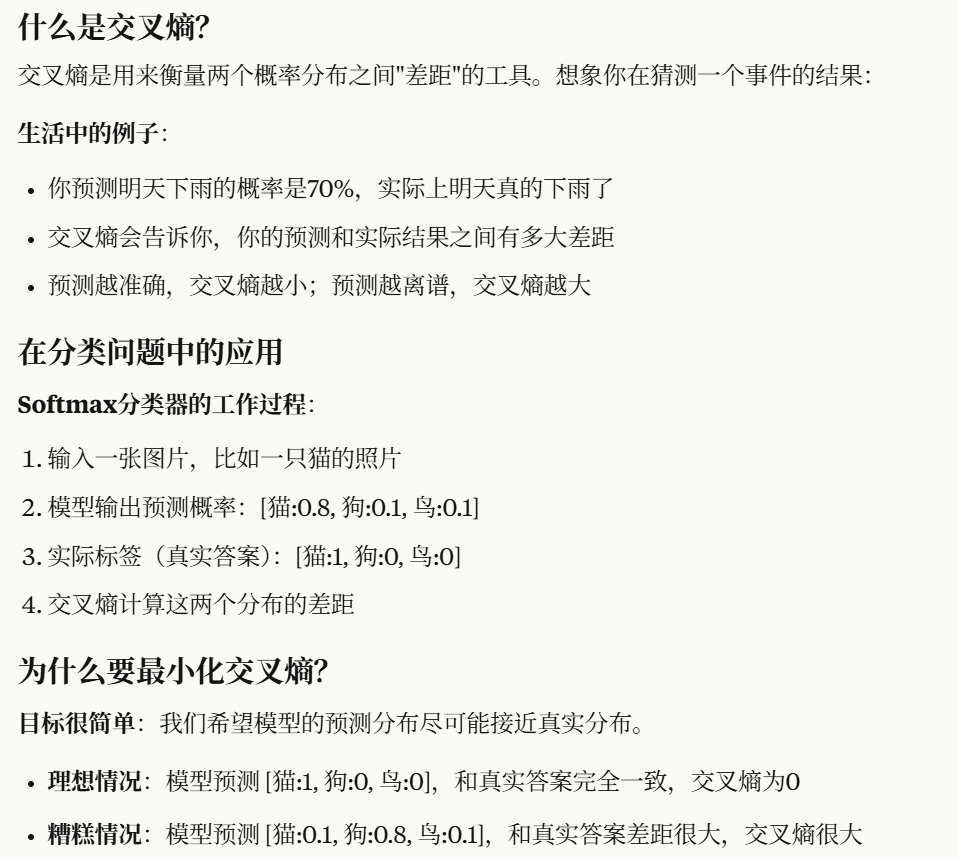

#  Linear Classification

##  从图像映射到标签分数

> The first component of this approach is to define the score function that maps the pixel values of an image to confidence scores for each class. We will develop the approach with a concrete example. As before, let’s assume a training dataset of images $x_i∈R^D$, each associated with a label yi. Here $i=1…N$ and $y_i∈1…K$. That is, we have **N** examples (each with a dimensionality **D**) and **K** distinct categories. For example, in CIFAR-10 we have a training set of **N** = 50,000 images, each with **D** = 32 x 32 x 3 = 3072 pixels, and **K** = 10, since there are 10 distinct classes (dog, cat, car, etc). We will now define the score function $f:R^D↦R^K$ that maps the raw image pixels to class scores.
> 此方法的第一个组件是定义 score 函数，该函数将图像的像素值映射到每个类的置信度分数。我们将通过一个具体的例子来开发该方法。和以前一样，我们假设一个图像的训练数据集，每个图像 $x_i∈R^D$ 都与一个标签 yi 相关联。这里 $i=1…N$ 和 $y_i∈1…K$ .也就是说，我们有 N 个示例（每个示例的维度为 D）和 K 个不同的类别。例如，在 CIFAR-10 中，我们有一个 N = 50,000 张图像的训练集，每张图像的 D = 32 x 32 x 3 = 3072 像素，K = 10，因为有 10 个不同的类别（狗、猫、汽车等）。现在，我们将定义将原始图像像素映射到类分数的 score 函数 $f:R^D↦R^K$ 。


###  函数解释

$x_i\isin[D \times 1]$ ,其实是转置之后了的 第i张图片，$D=weight\times height\times channles$

$W\in[K\times D]$ K是标签数，$b\in [K\times 1]$ 是偏置项，

最终组成一个线性映射，输出结果是$[K\times 1]$的向量，每个值代表属于这个标签的预期得分
$$
f(x_i,W,b)=Wx_i+b
$$


> In the above equation, we are assuming that the image xi has all of its pixels flattened out to a single column vector of shape [D x 1]. The matrix **W** (of size [K x D]), and the vector **b** (of size [K x 1]) are the **parameters** of the function. In CIFAR-10, xi contains all pixels in the i-th image flattened into a single [3072 x 1] column, **W** is [10 x 3072] and **b** is [10 x 1], so 3072 numbers come into the function (the raw pixel values) and 10 numbers come out (the class scores). The parameters in **W** are often called the **weights**, and **b** is called the **bias vector** because it influences the output scores, but without interacting with the actual data xi. However, you will often hear people use the terms *weights* and *parameters* interchangeably.
> 在上面的方程中，我们假设图像 xi 的所有像素都展平为形状为 [D x 1] 的单列向量。矩阵 W（大小为 [K x D]）和向量 b（大小为 [K x 1]）是函数的参数。在 CIFAR-10 中， xi 包含第 i 个图像中拼合为单个 [3072 x 1] 列的所有像素，W 为 [10 x 3072]，b 为 [10 x 1]，因此函数中有 3072 个数字（原始像素值），有 10 个数字（类分数）。W 中的参数通常称为权重，而 b 称为偏差向量，因为它会影响输出分数，但不与实际数据 xi 交互。但是，您经常会听到人们交替使用术语 weights 和 parameters。


 **NOTE：**

* 输入数据 $(x_i,y_i)$ 是给定的和固定的，但我们可以控制参数 W，b 的设置。我们的目标是找到参数，使计算出的分数与整个训练集中的真值标签相匹配。我们将更详细地介绍如何执行此作，但直观地说，我们希望正确类的分数高于错误类的分数。
* 这种方法的一个优点是训练数据用于学习参数 W，b，但是一旦学习完成，我们就可以丢弃整个训练集，只保留学习到的参数。这是因为新的测试图像可以简单地通过函数转发，并根据计算的分数进行分类。
* 最后，请注意，对测试图像进行分类涉及单个矩阵乘法和加法，这比将测试图像与所有训练图像进行比较要快得多（暴击KNN）。


###  **几何理解**

每个$x_i$是一张图片的像素信息，也是一个$D$维空间的点。（例如，CIFAR-10 中的每张图像都是 32x32x3 像素的 3072 维空间中的一个点）。类似地，整个数据集是一组（标记的）点。

由于我们将每个类的分数定义为所有图像像素的加权和，因此每个类分数都是此空间上的线性函数。我们无法可视化 3072 维空间，但如果我们想象将所有这些维度压缩为仅两个维度，那么我们可以尝试可视化分类器可能正在做什么：


正如我们在上面看到的，每一行 $W$ 都是其中一个类的分类器。这些数字的几何解释是，当我们更改 $W$ 的一行时，像素空间中的相应线将向不同的方向旋转。另一方面，偏差 $b$ 允许我们的分类器翻译这些行。特别要注意的是，如果没有偏差项，无论权重如何，插入 $x_i=0$ 都会得到零分，因为所有行都将被迫穿过原点。

###  模板匹配理解（template matching）

在计算机中的模板匹配是这样工作的：首先需要准备模板，比如我们要识别数字0-9，每个数字都有一个"标准样子"（模板），就像字帖上的标准字体。然后进行比较过程，当来了一个新的手写数字时，计算机会把它和每个数字的模板进行比较，看看最像哪个模板。最后找到答案，最相似的模板对应的数字就是答案，比如最像数字"8"的模板，那答案就是8。_这里的比较方式是计算图像与每个模板之间的内积值（看成一种距离），内积值最大的模板对应的类别就是分类结果_


> 这个模板就是把**权重矩阵W直接可视化**得到的。权重矩阵W是一个10×3072的矩阵（CIFAR-10有10个类别，图片是32×32×3=3072个像素），每一行对应一个类别的权重向量。可视化过程就是取出W的第i行（比如船对应的那一行），将这3072个数值重新排列成32×32×3的形状，然后直接显示为彩色图像。
>
> 这些模板看起来是模糊的图像，是因为权重值具有特定的物理意义。每个权重值表示对应像素位置的"重要性"：正值（亮色）表示该位置的像素对识别这个类别有正面作用，负值（暗色）表示有负面作用，零值（中性色）表示该位置的像素不重要。船模板中的蓝色区域权重为正值，意味着"如果输入图像这些位置是蓝色，更可能是船"，这正好对应了船经常出现在蓝色海洋上的先验知识。
>
> 因此，这些模板图像不是真实的照片，而是权重矩阵的直接可视化，它们展示了分类器认为每个类别"应该长什么样"的抽象表示。通过这种方式，我们可以直观地理解线性分类器是如何学习和识别不同类别特征的。


> 此外，请注意，马模板似乎包含一匹双头马，这是因为数据集中同时面向左侧和右侧的马。线性分类器将数据中的这两种马匹模式合并到一个模板中。同样，汽车分类器似乎已经将多种模式合并到一个模板中，该模板必须识别来自各个侧面和所有颜色的汽车。特别是，这个模板最终是红色的，这表明 CIFAR-10 数据集中的红色汽车比任何其他颜色的红色汽车都多。线性分类器太弱，无法正确解释不同颜色的汽车，但正如我们稍后将看到的，神经网络将允许我们执行这项任务。展望未来，神经网络将能够在其隐藏层中开发中间神经元，这些神经元可以检测特定的汽车类型（例如，绿色汽车面向左侧、蓝色汽车面向前方等），下一层的神经元可以通过单个汽车检测器的加权和将这些组合成更准确的汽车分数。


###  合并偏置项

分别跟踪两组参数（偏差 b 和权重 W ）有点麻烦。一个常用的技巧是将两组参数组合成一个矩阵，该矩阵包含这两个参数，方法是用一个始终保持常数 1 的附加维度（默认偏差维度）扩展向量 $x_i$ 。对于额外的维度，新的 score 函数将简化为单个矩阵乘法：
$$
f(x_i,W)=Wx_i
$$


##  损失函数(multicalss SVM)

先展示完整函数：
$$
L={1\over N} \sum_i\sum_j≠y_i[max(0,f(x_i,W)_j−f(x_i;W)y_i+Δ)]+λ\sum_k\sum_lW^2_{k,l}
$$

###  Data Loss

最终希望正确的行标签得分比其他行的标签得分都大一个阈值，所以先设计了$L_i$函数


scores的缩写，第j个类的scores分数$s_j=f(x_i,W)_j $ 
$$
L_i=\sum_{j≠y_i}max(0,s_j−s_{y_i}+Δ)
$$


###  Regularization Loss

**BUG:**

> 正规化。我们上面介绍的损失函数有一个 bug。假设我们有一个数据集和一组参数 W，它们可以正确地对每个样本进行分类（即所有分数都是为了满足所有边际，并且 Li=0 对于所有 i）。问题在于这组 W 不一定是唯一的：可能有许多类似的 W 可以正确地对示例进行分类。一种简单的方法是，如果某些参数 W 正确地对所有样本进行分类（因此每个样本的损失为零），那么这些参数 λW where λ>1 的任何倍数也将得到零损失，因为这种转换均匀地拉伸了所有分数幅度，因此也拉伸了它们的绝对差异。例如，如果正确类和最接近的错误类之间的分数差为 15，则将 W 的所有元素乘以 2 将使新的差值为 30。

为了惩罚W的范数过大，把W的二范数乘以一个超参数$\lambda$ (具体寻找一般用cross-validation 交叉验证)

二范数：
$$
R(W)=\sum_k\sum_lW^2_{k,l}
$$
完整的Multiclass SVM
$$
L = \underbrace{\frac{1}{N} \sum_{i} L_i}_{\text{data loss}} + \underbrace{\lambda R(W)}_{\text{regularization loss}}
$$

$$
L={1\over N} \sum_i\sum_j≠y_i[max(0,f(x_i,W)_j−f(x_i;W)y_i+Δ)]+λ\sum_k\sum_lW^2_{k,l}
$$


* regularization loss会偏向于更平均的w，而不是更尖锐的


* 合并偏置项影响不大，由于regularization loss损失函数值永远不会为0，除非$W=0$ 


###  代码

```python
def L_i(x, y, W):
  """
  unvectorized version. Compute the multiclass svm loss for a single example (x,y)
  - x is a column vector representing an image (e.g. 3073 x 1 in CIFAR-10)
    with an appended bias dimension in the 3073-rd position (i.e. bias trick)
  - y is an integer giving index of correct class (e.g. between 0 and 9 in CIFAR-10)
  - W is the weight matrix (e.g. 10 x 3073 in CIFAR-10)
  """
  delta = 1.0 # see notes about delta later in this section
  scores = W.dot(x) # scores becomes of size 10 x 1, the scores for each class
  correct_class_score = scores[y]
  D = W.shape[0] # number of classes, e.g. 10
  loss_i = 0.0
  for j in range(D): # iterate over all wrong classes
    if j == y:
      # skip for the true class to only loop over incorrect classes
      continue
    # accumulate loss for the i-th example
    loss_i += max(0, scores[j] - correct_class_score + delta)
  return loss_i

def L_i_vectorized(x, y, W):
  """
  A faster half-vectorized implementation. half-vectorized
  refers to the fact that for a single example the implementation contains
  no for loops, but there is still one loop over the examples (outside this function)
  """
  delta = 1.0
  scores = W.dot(x)
  # compute the margins for all classes in one vector operation
  margins = np.maximum(0, scores - scores[y] + delta)
  # on y-th position scores[y] - scores[y] canceled and gave delta. We want
  # to ignore the y-th position and only consider margin on max wrong class
  margins[y] = 0
  loss_i = np.sum(margins)
  return loss_i

def L(X, y, W):
  """
  fully-vectorized implementation :
  - X holds all the training examples as columns (e.g. 3073 x 50,000 in CIFAR-10)
  - y is array of integers specifying correct class (e.g. 50,000-D array)
  - W are weights (e.g. 10 x 3073)
  """
  # evaluate loss over all examples in X without using any for loops
  # left as exercise to reader in the assignment
```


###  实践经验

* $\Delta$ 总是可以取1.0，关键在于$\lambda $ 


* 其他对SVM的优化，课程是最原始的SVM，之后引入了kernels（内核），duals(对偶)，SMO algorithm。
* 尽管max（x,y）不可微分，但在实践中可以用次梯度
* 其他版本

> **Aside: Other Multiclass SVM formulations.** It is worth noting that the Multiclass SVM presented in this section is one of few ways of formulating the SVM over multiple classes. Another commonly used form is the *One-Vs-All* (OVA) SVM which trains an independent binary SVM for each class vs. all other classes. Related, but less common to see in practice is also the *All-vs-All* (AVA) strategy. Our formulation follows the [Weston and Watkins 1999 (pdf)](https://www.elen.ucl.ac.be/Proceedings/esann/esannpdf/es1999-461.pdf) version, which is a more powerful version than OVA (in the sense that you can construct multiclass datasets where this version can achieve zero data loss, but OVA cannot. See details in the paper if interested). The last formulation you may see is a *Structured SVM*, which maximizes the margin between the score of the correct class and the score of the highest-scoring incorrect runner-up class. Understanding the differences between these formulations is outside of the scope of the class. The version presented in these notes is a safe bet to use in practice, but the arguably simplest OVA strategy is likely to work just as well (as also argued by Rikin et al. 2004 in [In Defense of One-Vs-All Classification (pdf)](http://www.jmlr.org/papers/volume5/rifkin04a/rifkin04a.pdf)).
> 旁白：其他 Multiclass SVM 公式。值得注意的是，本节中介绍的 Multiclass SVM 是在多个类上构建 SVM 的少数几种方法之一。另一种常用的形式是一对多 （OVA） SVM，它为每个类训练一个独立的二进制 SVM，而不是所有其他类。与此相关但在实践中不太常见的是 All-vs-All （AVA） 策略。我们的公式遵循 Weston 和 Watkins 1999 （pdf） 版本，该版本比 OVA 更强大（从某种意义上说，您可以构建多类数据集，其中此版本可以实现零数据丢失，但 OVA 不能。如果有兴趣，请参阅论文中的详细信息）。您可能看到的最后一个公式是结构化 SVM，它使正确类的分数与得分最高的错误亚军类的分数之间的边距最大化。了解这些表述之间的差异超出了本课程的范围。这些说明中介绍的版本在实践中使用是一个安全的赌注，但可以说最简单的 OVA 策略可能同样有效（正如 Rikin 等人在 2004 年在 In Defense of One-V-All Classification （pdf） 中也论证的那样）。


##  Softmax 分类器

$f(x_i,W)\in[K\times 1]$仍然是scores分数函数

$f_j$是$f$的第j个值，$L$仍然是data loss, $L_i(i\in {1,2······，N})$ 是第i张图片的损失
$$
L_i = -\log\left(\frac{e^{f_{y_i}}}{\sum_j e^{f_j}}\right) \quad \text{or equivalently} \quad L_i = -f_{y_i} + \log\sum_j e^{f_j}
$$
最终函数当然也是：
$$
L = \underbrace{\frac{1}{N} \sum_{i} L_i}_{\text{data loss}} + \underbrace{\lambda R(W)}_{\text{regularization loss}}
$$


###  信息论和概率观点

**交叉熵**
$$
H(p,q)=−\sum_xp(x)logq(x)
$$
p是真实分布，q是估计分布



* 要使$L_i$减小至0，即括号里等于1，对于$q={e^{f_{y_j}}\over\sum_je^{f_{j}}}$ 理想是等于真实分布$p=[0,0,···，1,0,···]$ 第$y_i$ 个为1

* 事实上，等式也决定了输出分布是一个概率分布，但是这个分布的扩散程度取决于$\lambda$ 


###  实践经验


```python
f = np.array([123, 456, 789]) # example with 3 classes and each having large scores
p = np.exp(f) / np.sum(np.exp(f)) # Bad: Numeric problem, potential blowup

# instead: first shift the values of f so that the highest number is 0:
f -= np.max(f) # f becomes [-666, -333, 0]
p = np.exp(f) / np.sum(np.exp(f)) # safe to do, gives the correct answer

```


##  SVM vs. Softmax


* SVM的hinge function（他的data loss）关键在于阈值$\Delta $ 超出阈值则不再关心，data loss = 0

而 softmax会一直迭代希望趋于理想情况


##  Summary

* 定义了评分函数score function ，目标就是求W,b的参数，本节课只介绍了损失函数，没介绍如何更新参数

$$
f(x_i,W,b)=Wx_i+b
$$

$x_i\isin[D \times 1]$ ，$D=weight\times height\times channles$ ，$W\in[K\times D]$ ，$b\in [K\times 1]$ ，$K$是标签数

* 合并偏置的技巧（bias trick）


* 线性分类器中两个常用损失：SVM和Softmax，区别在于$L_i$ 

  SVM：
  $$
  L_i=\sum_{j≠y_i}max(0,s_j−s_{y_i}+Δ)
  $$
  

   Softmax：
  $$
  L_i = -\log\left(\frac{e^{f_{y_i}}}{\sum_j e^{f_j}}\right) \quad \text{or equivalently} \quad L_i = -f_{y_i} + \log\sum_j e^{f_j}
  $$
  

  总形式：

  
  $$
  L = \underbrace{\frac{1}{N} \sum_{i} L_i}_{\text{data loss}} + \underbrace{\lambda R(W)}_{\text{regularization loss}}
  $$
  

$$
L={1\over N} \sum_i\sum_j≠y_i[max(0,f(x_i,W)_j−f(x_i;W)y_i+Δ)]+λ\sum_k\sum_lW^2_{k,l}
$$

