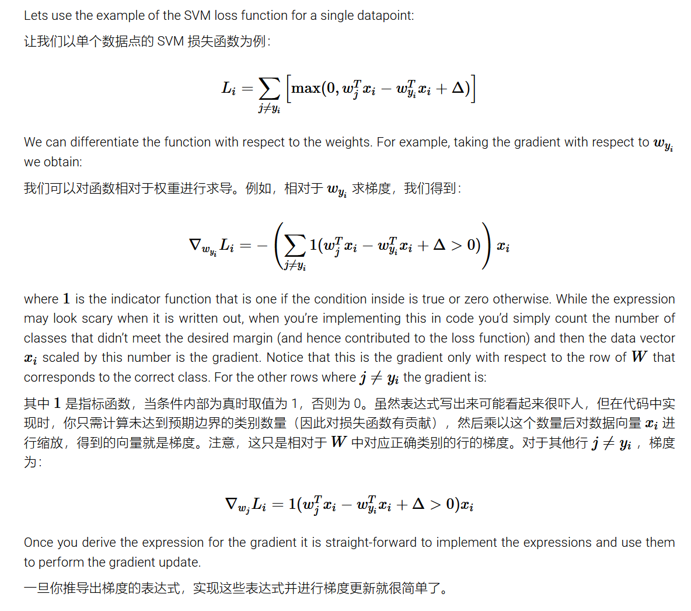
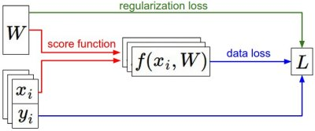

#  梯度下降


 

##  策略一：随机搜索

```python
# assume X_train is the data where each column is an example (e.g. 3073 x 50,000)
# assume Y_train are the labels (e.g. 1D array of 50,000)
# assume the function L evaluates the loss function

bestloss = float("inf") # Python assigns the highest possible float value
for num in range(1000):
  W = np.random.randn(10, 3073) * 0.0001 # generate random parameters
  loss = L(X_train, Y_train, W) # get the loss over the entire training set
  if loss < bestloss: # keep track of the best solution
    bestloss = loss
    bestW = W
  print 'in attempt %d the loss was %f, best %f' % (num, loss, bestloss)

# prints:
# in attempt 0 the loss was 9.401632, best 9.401632
# in attempt 1 the loss was 8.959668, best 8.959668
# in attempt 2 the loss was 9.044034, best 8.959668
# in attempt 3 the loss was 9.278948, best 8.959668
# in attempt 4 the loss was 8.857370, best 8.857370
# in attempt 5 the loss was 8.943151, best 8.857370
# in attempt 6 the loss was 8.605604, best 8.605604
# ... (trunctated: continues for 1000 lines)
```

With the best **W** this gives an accuracy of about **15.5%**. Given that guessing classes completely at random achieves only 10%,  that’s not a very bad outcome for a such a brain-dead random search  solution!
使用最佳 W 时，准确率约为 15.5%。考虑到完全随机猜测类别只能达到 10%，对于这样一个愚蠢的随机搜索解决方案来说，这结果还不算太差！

##  策略二：随机局部搜索

The first strategy you may think of is to try to extend one foot in a  random direction and then take a step only if it leads downhill.  Concretely, we will start out with a random *W*, generate random perturbations *δ**W* to it and if the loss at the perturbed *W*+*δ**W* is lower, we will perform an update. The code for this procedure is as follows:
你可能首先想到的策略是尝试随机方向伸出一脚，只有当它通向山下时才迈出一步。具体来说，我们将从一个随机值 $W$开始，生成它的随机扰动 $δW$ ，如果扰动 $W+δW$ 处的损失更低，我们将执行更新。这个过程的代码如下：

```python 
W = np.random.randn(10, 3073) * 0.001 # generate random starting W
bestloss = float("inf")
for i in range(1000):
  step_size = 0.0001
  Wtry = W + np.random.randn(10, 3073) * step_size
  loss = L(Xtr_cols, Ytr, Wtry)
  if loss < bestloss:
    W = Wtry
    bestloss = loss
  print 'iter %d loss is %f' % (i, bestloss)

```

Using the same number of loss function evaluations as before (1000), this approach achieves test set classification accuracy of **21.4%**. This is better, but still wasteful and computationally expensive.
使用与之前相同数量的损失函数评估（1000 次），这种方法在测试集上实现了 21.4%的分类准确率。这更好了，但仍然浪费且计算成本高昂

##  策略三：沿梯度下降

**一、数值计算梯度 中心差分公式：**
$$
\frac{\partial f}{\partial x_i} \approx 
\frac{f(x+h \cdot e_i) - f(x-h \cdot e_i)}{2h}
$$

- **(x)**: 输入变量向量。
- **(e_i)**: 单位向量，表示仅对第 (i) 个变量进行扰动。
- **(h)**: 一个很小的数值（通常取 (10^{-5}) 或更小）。

通用性强：适用于任何函数，只需能计算函数值。但当变量维度较高时，计算代价会显著增加

**梯度计算复杂度**：与参数数量呈线性关系。在我们的例子中，总共有 30730 个参数，因此为了计算梯度并执行单个参数更新，我们必须对损失函数进行 30,731  次评估。这个问题只会变得更糟，因为现代神经网络很容易拥有数百万个参数。显然，这种策略是不可扩展的，我们需要更好的方法。

```python
import numpy as np

def numerical_gradient(f, x):
    h = 1e-5  # 微小扰动
    grad = np.zeros_like(x)
    
    for i in range(x.size):
        x_i_original = x[i]
        
        # 计算 f(x + h)
        x[i] = x_i_original + h
        f_plus_h = f(x)
        
        # 计算 f(x - h)
        x[i] = x_i_original - h
        f_minus_h = f(x)
        
        # 梯度近似
        grad[i] = (f_plus_h - f_minus_h) / (2 * h)
        
        # 恢复 x[i]
        x[i] = x_i_original
    
    return grad

# 示例函数
def sample_function(x):
    return np.sum(x**2)

# 计算数值梯度
x = np.array([3.0, 4.0])
gradient = numerical_gradient(sample_function, x)
print("数值梯度:", gradient)
```

用梯度下降迭代$W$:

```python

# to use the generic code above we want a function that takes a single argument
# (the weights in our case) so we close over X_train and Y_train
def CIFAR10_loss_fun(W):
  return L(X_train, Y_train, W)

W = np.random.rand(10, 3073) * 0.001 # random weight vector
df = eval_numerical_gradient(CIFAR10_loss_fun, W) # get the gradient
```

```python
loss_original = CIFAR10_loss_fun(W) # the original loss
print 'original loss: %f' % (loss_original, )

# lets see the effect of multiple step sizes
for step_size_log in [-10, -9, -8, -7, -6, -5,-4,-3,-2,-1]:
  step_size = 10 ** step_size_log
  W_new = W - step_size * df # new position in the weight space
  loss_new = CIFAR10_loss_fun(W_new)
  print 'for step size %f new loss: %f' % (step_size, loss_new)

# prints:
# original loss: 2.200718
# for step size 1.000000e-10 new loss: 2.200652
# for step size 1.000000e-09 new loss: 2.200057
# for step size 1.000000e-08 new loss: 2.194116
# for step size 1.000000e-07 new loss: 2.135493
# for step size 1.000000e-06 new loss: 1.647802
# for step size 1.000000e-05 new loss: 2.844355
# for step size 1.000000e-04 new loss: 25.558142
# for step size 1.000000e-03 new loss: 254.086573
# for step size 1.000000e-02 new loss: 2539.370888
# for step size 1.000000e-01 new loss: 25392.214036
```

**Update in negative gradient direction**. In the code above, notice that to compute `W_new` we are making an update in the negative direction of the gradient `df` since we wish our loss function to decrease, not increase.
**沿负梯度方向进行更新**：在上述代码中，请注意，为了计算 `W_new` ，我们在梯度 `df` 的负方向上进行更新，因为我们希望损失函数减小，而不是增大。

**Effect of step size**. The gradient tells us the direction in which the function has the  steepest rate of increase, but it does not tell us how far along this  direction we should step. As we will see later in the course, choosing  the step size (also called the *learning rate*) will become one of the most important (and most headache-inducing)  hyperparameter settings in training a neural network. In our blindfolded hill-descent analogy, we feel the hill below our feet sloping in some  direction, but the step length we should take is uncertain. If we  shuffle our feet carefully we can expect to make consistent but very  small progress (this corresponds to having a small step size).  Conversely, we can choose to make a large, confident step in an attempt  to descend faster, but this may not pay off. As you can see in the code  example above, at some point taking a bigger step gives a higher loss as we “overstep”.
**步长（学习率）的影响**：梯度告诉我们函数增加最快的方向，但它并没有告诉我们应该沿着这个方向走多远。正如我们将在课程后面看到的，选择步长（也称为学习率）将成为训练神经网络时最重要的（也是最令人头疼的）超参数设置之一。在我们的蒙眼下山类比中，我们感觉到脚下的山坡朝某个方向倾斜，但我们应该走多长的步长是不确定的。如果我们小心地移动双脚，我们可以预期取得一致但非常小的进步（这对应于较小的步长）。相反，我们可以选择大胆地迈出大步，试图更快地下山，但这可能不会奏效。正如你在上面的代码示例中可以看到的，在某个时刻，迈出更大的步长会导致更高的损失，因为我们“越过了”。

**二、解析梯度**：有了损失函数表达式 能计算导数的 可以直接快速计算，为了验证解析求导没问题，通常计算解析梯度并将其与数值梯度进行比较，以检查实现的正确性。这被称为梯度检查（**gradient check**.）。



这里一次性对一行元素求导了  W求梯度之后 梯度本身也是一个矩阵 W每一个元素说明有一个分量

##  小批量梯度下降

**Mini-batch gradient descent.** In large-scale applications (such as the ILSVRC challenge), the  training data can have on order of millions of examples. Hence, it seems wasteful to compute the full loss function over the entire training set in order to perform only a single parameter update. A very common  approach to addressing this challenge is to compute the gradient over **batches** of the training data. For example, in current state of the art  ConvNets, a typical batch contains 256 examples from the entire training set of 1.2 million. This batch is then used to perform a parameter  update:
小批量梯度下降。在大规模应用（如 ILSVRC  挑战赛）中，训练数据可以包含数百万个样本。因此，为了执行单个参数更新而计算整个训练集的全损失函数似乎很浪费。解决这一挑战的常用方法是在训练数据的批量上计算梯度。例如，在当前最先进的卷积神经网络中，一个典型的批量包含来自 120 万样本训练集的 256 个样本。然后使用这个批量来执行参数更新：

```python
# Vanilla Minibatch Gradient Descent

while True:
  data_batch = sample_training_data(data, 256) # sample 256 examples
  weights_grad = evaluate_gradient(loss_fun, data_batch, weights)
  weights += - step_size * weights_grad # perform parameter update
```

The extreme case of this is a setting where the mini-batch contains only a single example. This process is called **Stochastic Gradient Descent (SGD)** (or also sometimes **on-line** gradient descent). This is relatively less common to see because in  practice due to vectorized code optimizations it can be computationally  much more efficient to evaluate the gradient for 100 examples, than the  gradient for one example 100 times. Even though SGD technically refers  to using a single example at a time to evaluate the gradient, you will  hear people use the term SGD even when referring to mini-batch gradient  descent (i.e. mentions of MGD for “Minibatch Gradient Descent”, or BGD  for “Batch gradient descent” are rare to see), where it is usually  assumed that mini-batches are used. The size of the mini-batch is a  hyperparameter but it is not very common to cross-validate it. It is  usually based on memory constraints (if any), or set to some value, e.g. 32, 64 or 128. We use powers of 2 in practice because many vectorized  operation implementations work faster when their inputs are sized in  powers of 2.
这种极端情况是当小批量只包含一个样本时。这个过程称为随机梯度下降（SGD）（有时也称为在线梯度下降）。这种情况相对较少见，因为在实践中，由于向量化代码优化，评估 100 个样本的梯度通常比评估一个样本 100 次的梯度在计算上更高效。尽管 SGD  在技术上是指一次使用一个样本来评估梯度，但你可能会听到人们在提到小批量梯度下降时使用 SGD 这个术语（即“小批量梯度下降”的 MGD  或“批量梯度下降”的 BGD  的说法很少见），通常假设使用小批量。小批量的大小是一个超参数，但通常不会对其进行交叉验证。它通常基于内存限制（如果有），或设置为某个值，例如  32、64 或 128。在实践中我们使用 2 的幂，因为许多向量化操作的实现当输入大小为 2 的幂时运行得更快。

##  总结



Summary of the information flow. The dataset of pairs of **(x,y)** is given and fixed. The weights start out as random numbers and can  change. During the forward pass the score function computes class  scores, stored in vector **f**. The loss function contains two components: The data loss computes the compatibility between the scores **f** and the labels **y**. The regularization loss is only a function of the weights. During  Gradient Descent, we compute the gradient on the weights (and optionally on data if we wish) and use them to perform a parameter update during  Gradient Descent.  
信息流概要。给定的(x,y)对数据集是固定的。权重最初是随机数，可以改变。在前向传播过程中，得分函数计算类别得分，存储在向量 f 中。损失函数包含两个组成部分：数据损失计算得分 f 与标签 y  之间的兼容性。正则化损失仅是权重的函数。在梯度下降过程中，我们计算权重（以及如果我们希望的话，数据）的梯度，并使用它们在梯度下降期间执行参数更新。