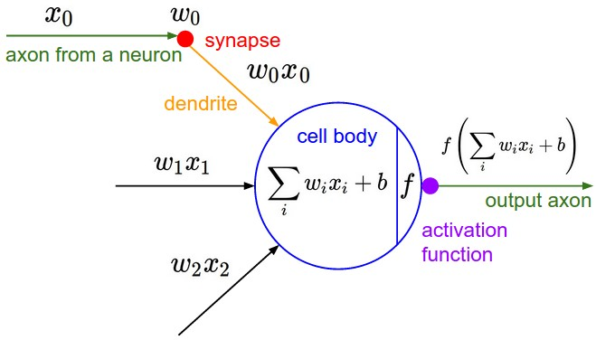
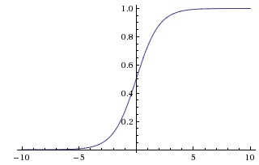
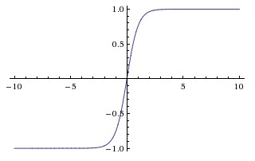
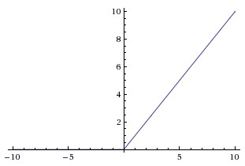
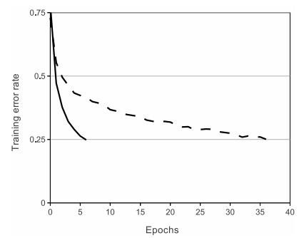
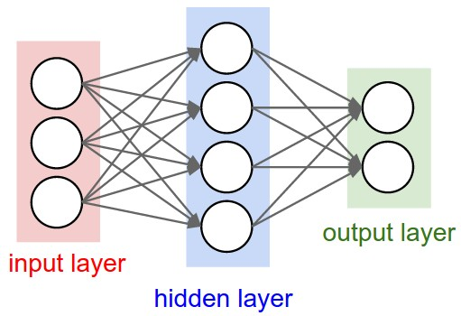
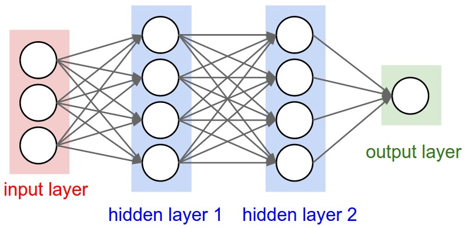
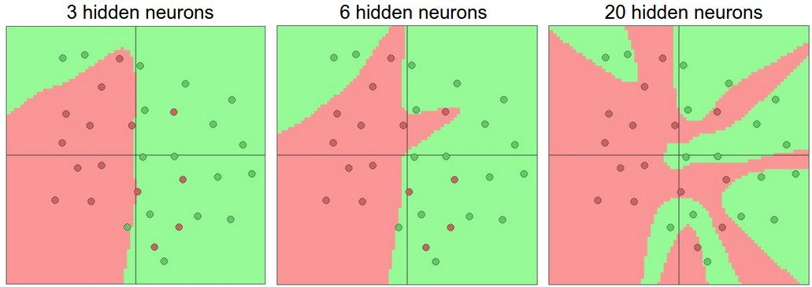
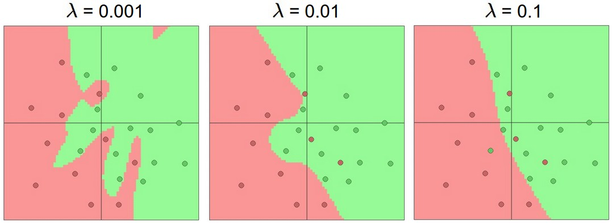

#   神经网络

##   快速介绍

在线性分类部分，我们使用公式 $s=Wx$ 根据图像计算不同视觉类别的分数，其中 $W$ 是一个矩阵， $x$ 是一个包含图像所有像素数据的输入列向量。在 CIFAR-10 的情况下， $x$ 是一个 [3072x1] 列向量， $W$ 是一个 [10x3072] 矩阵，因此输出分数是一个包含 10 个类别分数的向量。

一个示例神经网络会计算 $s=W_2max(0,W_1x)$ 。在这里， $W_1$ 可以是一个 [100x3072] 的矩阵，将图像转换为一个 100 维的中间向量。函数 $max(0,−)$ 是一个逐元素应用的非线性函数。我们可以为非线性函数做出几种选择（我们将在下面学习），但这个选择是常见的，它简单地将所有低于零的激活值置零。最后，矩阵 $W_2$ 的尺寸将是 [10x100]，这样我们再次得到 10 个数字，我们将它们解释为类别分数。请注意，非线性函数在计算上至关重要——如果我们省略它，两个矩阵可以合并为一个矩阵，因此预测的类别分数再次成为输入的线性函数。非线性函数是我们获得波动的地方。参数 $W_2$,$W_1$ 是通过随机梯度下降学习的，它们的梯度是通过链式法则（并使用反向传播计算）得到的。

**链式法则（解析梯度）：**
$$
h = \sigma(W_1 x), \quad 
\hat{y} = W_2 h, \quad
L = \text{loss}(\hat{y}, y).
$$
这里 $W_1, W_2$ 是参数矩阵。我们要算损失函数 $L$ 对 $W_1, W_2$ 的梯度：

- 不用中心差分（太慢）。

- 所以用 **链式法则**：
  $$
  \frac{\partial L}{\partial W_2} = \frac{\partial L}{\partial \hat{y}} \cdot \frac{\partial \hat{y}}{\partial W_2},
  $$

  $$
  \frac{\partial L}{\partial W_1} = \frac{\partial L}{\partial \hat{y}} \cdot \frac{\partial \hat{y}}{\partial h} \cdot \frac{\partial h}{\partial W_1}.
  $$

一个三层神经网络可以类似地表示为 $s=W_3max(0,W_2max(0,W_1x))$ ，其中所有 $W_3,W_2,W_1$ 都是待学习的参数。中间隐藏向量的尺寸是网络的超参数，我们稍后将看到如何设置它们。现在让我们来看看从神经元/网络的角度如何解释这些计算。



单个神经的代码示例：

```python
class Neuron(object):
  # ... 
  def forward(self, inputs):
    """ assume inputs and weights are 1-D numpy arrays and bias is a number """
    cell_body_sum = np.sum(inputs * self.weights) + self.bias
    firing_rate = 1.0 / (1.0 + math.exp(-cell_body_sum)) # sigmoid activation function
    return firing_rate

```


##  常用激活函数

###  **Sigmoid：**



Sigmoid 非线性函数具有数学形式 $σ(x)=1/(1+e−x)$ ，如上图左侧所示。正如上一节所暗示的，它将一个实数值“压缩”到 0 和 1 之间。具体来说，大的负数变为 0，大的正数变为 1。由于  sigmoid  函数具有作为神经元放电率的良好解释——从完全不放电（0）到在假设的最大频率下完全饱和放电（1），它在历史上被频繁使用。在实践中，sigmoid  非线性函数最近已不再流行，几乎不再使用。

**它有两个主要缺点：**

* **Sigmoid 函数会饱和并杀死梯度**。Sigmoid 神经元的一个非常不受欢迎的特性是，当神经元的激活值在 0 或 1  的任一端饱和时，该**区域的梯度几乎为零**。回想一下，在反向传播过程中，这个（局部）梯度将被乘以该门输出梯度的整个目标。因此，如果局部梯度非常小，它将有效地“杀死”梯度，几乎没有任何信号通过该神经元传递到其权重，并递归地传递到其数据。此外，在**初始化 Sigmoid 神经元的权重时，必须格外小心以防止饱和**。例如，如果初始权重太大，那么大多数神经元都会饱和，网络几乎无法学习。
* **Sigmoid 函数的输出不是以零为中心的**。这并不理想，因为神经网络中后期的处理层（稍后会详细说明）接收到的数据将不是以零为中心的。这对梯度下降的动态特性有影响，因为如果输入到神经元的数据总是正的（例如在 $f=w^Tx+b$ 中的 $x>0$ 逐元素），那么在反向传播过程中，权重 *w* 的梯度将**全部为正或全部为负**（取决于整个表达式 *f* 的梯度）。这可能会在权重更新的梯度中引入不理想的**锯齿状动态**。然而，请注意，一旦这些梯度在数据批次中加总，权重的最终更新可能会有不同的符号，这在一定程度上缓解了这个问题。因此，这是一个不便之处，但与上面提到的饱和激活问题相比，其后果没有那么严重。

**双曲正切函数（tanh）**



Tanh。图像右侧显示了 tanh 非线性。它将实数值压缩到[-1, 1]的范围内。与 sigmoid 神经元类似，它的激活会饱和，但与 sigmoid  神经元不同的是，它的输出是零中心的。因此，在实践中，tanh 非线性总是比 sigmoid 非线性更受青睐。此外，请注意 tanh  神经元本质上是一个缩放的 sigmoid 神经元，特别是以下关系成立： tanh(*x*)=2*σ*(2*x*)−1 。

###  **ReLU**（The Rectified Linear Unit）



修正线性单元在近几年变得非常流行。它计算函数 $f(x)=max(0,x)$ 。换句话说，激活值简单地以零为阈值（见上图左侧）。使用 ReLU 有几个优点和缺点： 

* (+) 研究发现，与 sigmoid/tanh 函数相比，它可以极大地加速随机梯度下降的收敛（例如，Krizhevsky 等人中提到的 6 倍加速）。有人认为这是由于其线性、非饱和的形式所致。
* (+) 相比于 tanh/sigmoid 神经元涉及的计算成本较高的操作（如指数运算等），ReLU 可以通过简单地将激活矩阵的阈值设为零来实现。
* (-) 不幸的是，ReLU 单元在训练过程中可能很脆弱，并且可能会“死亡”。例如，一个大的梯度通过 ReLU  神经元时，假设某次更新后，神经元的参数被改得非常极端，***f*对所有训练样本都小于 0**。如果发生这种情况，那么从此刻起通过该单元的梯度将永远为零。也就是说，ReLU 单元在训练过程中可能会不可逆地死亡，因为它们可能会被从数据流形上撞落。例如，如果学习率设置得过大，你可能会发现多达  40%的神经元会“死亡”（即在整个训练数据集中从未激活的神经元所占比例）。通过合理设置学习率，这个问题不太常见。

**Leaky ReLU**

Leaky ReLUs 是解决“死亡 ReLU”问题的一种尝试。当 x < 0 时，Leaky ReLU 的函数值不再是零，而是有一个小的正斜率（如 0.01 或稍大）。也就是说，函数计算的是 $f(x)=1(x<0)(αx)+1(x>=0)(x)$ ，其中 *α* 是一个小的常数。有些人报告说这种激活函数形式取得了成功，但结果并不总是稳定一致。负区域的斜率也可以作为每个神经元的参数。

**Maxout**

Other types of units have been proposed that do not have the functional form $f(w^Tx+b)$ where a non-linearity is applied on the dot product between the weights and the data. One relatively popular choice is the Maxout neuron  (introduced recently by [Goodfellow et al.](https://arxiv.org/abs/1302.4389)) that generalizes the ReLU and its leaky version. The Maxout neuron computes the function $max(w^T_1x+b_1,w^T_2x+b_2)$. Notice that both ReLU and Leaky ReLU are a special case of this form (for example, for ReLU we have $w_1,b_1=0$). The Maxout neuron therefore enjoys all the benefits of a ReLU unit  (linear regime of operation, no saturation) and does not have its  drawbacks (dying ReLU). However, unlike the ReLU neurons it doubles the  number of parameters for every single neuron, leading to a high total  number of parameters.
已经提出了其他类型的单元，它们的功能形式不是$f(w^Tx+b)$ ，其中在权重和数据之间的点积上应用非线性。一个相对流行的选择是 Maxout 神经元（由 Goodfellow 等人最近引入），它推广了 ReLU 及其泄漏版本。Maxout 神经元计算函数$max(w^T_1x+b_1,w^T_2x+b_2)$ 。请注意，ReLU 和 Leaky ReLU 都是这种形式的特例（例如，对于 ReLU 我们有 $w_1,b_1=0$）。因此，Maxout 神经元享有 ReLU 单元的所有好处（线性工作模式，无饱和），并且没有其缺点（死亡 ReLU）。然而，与 ReLU 神经元不同，它为每个神经元加倍参数数量，导致总参数数量很高。

###   summy

This concludes our discussion of the most common types of neurons and their  activation functions. As a last comment, it is very rare to mix and  match different types of neurons in the same network, even though there  is no fundamental problem with doing so.
这结束了我们关于最常见的神经元类型及其激活函数的讨论。作为最后的评论，在同一网络中混合搭配不同类型的神经元是非常罕见的，尽管这样做并没有根本问题。

**TLDR**: “*What neuron type should I use?*” Use the ReLU non-linearity, be careful with your learning rates and  possibly monitor the fraction of “dead” units in a network. If this  concerns you, give Leaky ReLU or Maxout a try. Never use sigmoid. Try  tanh, but expect it to work worse than ReLU/Maxout.
TLDR：“我应该使用哪种神经元类型？”使用 ReLU 非线性，小心你的学习率，并可能监控网络中“死亡”单元的比例。如果这让你担心，可以尝试 Leaky ReLU 或  Maxout。永远不要使用 sigmoid。尝试 tanh，但要预期它的工作效果不如 ReLU/Maxout。


##  神经网络架构

###   图解



**Naming conventions.** Notice that when we say N-layer neural network, we do not count the  input layer. Therefore, a single-layer neural network describes a  network with no hidden layers (input directly mapped to output). In that sense, you can sometimes hear people say that logistic regression or  SVMs are simply a special case of single-layer Neural Networks. You may  also hear these networks interchangeably referred to as *“Artificial Neural Networks”* (ANN) or *“Multi-Layer Perceptrons”* (MLP). Many people do not like the analogies between Neural Networks and real brains and prefer to refer to neurons as *units*.
命名规范。请注意，当我们说 N  层神经网络时，我们不包括输入层。因此，单层神经网络描述了一个没有隐藏层的网络（输入直接映射到输出）。从这个意义上说，你有时会听到有人称逻辑回归或 SVM  只是单层神经网络的特殊情况。你也可能听到这些网络被互换地称为“人工神经网络”（ANN）或“多层感知器”（MLP）。许多人不喜欢神经网络与真实大脑之间的类比，并倾向于将神经元称为单元。

**Output layer.** Unlike all layers in a Neural Network, the output layer neurons most  commonly do not have an activation function (or you can think of them as having a linear identity activation function). This is because the last output layer is usually taken to represent the class scores (e.g. in  classification), which are arbitrary real-valued numbers, or some kind  of real-valued target (e.g. in regression).
输出层。与神经网络中的所有其他层不同，输出层神经元通常没有激活函数（或者你可以认为它们具有线性恒等激活函数）。这是因为最后一个输出层通常被用来表示类别分数（例如在分类中），这些是任意的实数值数字，或者某种实数值目标（例如在回归中）。

**Sizing neural networks**. The two metrics that people commonly use to measure the size of neural  networks are the number of neurons, or more commonly the number of  parameters. Working with the two example networks in the above picture:
确定神经网络的规模。人们通常使用两个指标来衡量神经网络的规模：神经元数量，或者更常见的是参数数量。以上面图片中的两个示例网络为例：

- The first network (left) has 4 + 2 = 6 neurons (not counting the inputs),  [3 x 4] + [4 x 2] = 20 weights and 4 + 2 = 6 biases, for a total of 26  learnable parameters.
  第一个网络（左侧）有 4 + 2 = 6 个神经元（不计输入），[3 x 4] + [4 x 2] = 20 个权重和 4 + 2 = 6 个偏置，总共 26 个可学习参数。
- The second network (right) has 4 + 4 + 1 = 9 neurons, [3 x 4] + [4 x 4] +  [4 x 1] = 12 + 16 + 4 = 32 weights and 4 + 4 + 1 = 9 biases, for a total of 41 learnable parameters.
  第二个网络（右侧）有 4 + 4 + 1 = 9 个神经元，[3 x 4] + [4 x 4] + [4 x 1] = 12 + 16 + 4 = 32 个权重和 4 + 4 + 1 = 9 个偏置，总共 41 个可学习参数。

### 计算举例

神经网络组织成层的主要原因之一是这种结构使得使用矩阵向量运算来评估神经网络非常简单和高效。以图上所示的三个层神经网络为例，输入将是一个[3x1]向量。一个层所有的连接强度可以存储在一个矩阵中。例如，第一个隐藏层的权重 `W1` 的尺寸为[4x3]，所有单元的偏差在向量 `b1` 中，尺寸为[4x1]。在这里，每个神经元都有其权重在 `W1` 的一行中，因此矩阵向量乘法 `np.dot(W1,x)` 评估了该层所有神经元的激活值。类似地， `W2` 将是一个[4x4]矩阵，存储第二个隐藏层的连接，而 `W3` 是一个[1x4]矩阵，用于最后一个（输出）层。这个三层神经网络的完整前向传递简单地就是三次矩阵乘法，与激活函数的应用交织在一起

```python
# forward-pass of a 3-layer neural network:
f = lambda x: 1.0/(1.0 + np.exp(-x)) # activation function (use sigmoid)
x = np.random.randn(3, 1) # random input vector of three numbers (3x1)
h1 = f(np.dot(W1, x) + b1) # calculate first hidden layer activations (4x1)
h2 = f(np.dot(W2, h1) + b2) # calculate second hidden layer activations (4x1)
out = np.dot(W3, h2) + b3 # output neuron (1x1)

```

在上述代码中， `W1,W2,W3,b1,b2,b3` 是网络的可学习参数。请注意， `x` 不再是单个输入列向量，而是可以容纳整个训练数据批次（其中每个输入样本将是 `x` 的一列），然后所有样本可以并行高效地评估。请注意，最终的神经网络层通常没有激活函数（例如，在分类设置中，它表示一个（实值）类分数）。

##  应对过拟合


**参数的多少(但是不应该减少参数）**

例如，假设我们有一个二维的二分类问题。我们可以训练三个独立的神经网络，每个网络有一个大小适当的隐藏层，并获得以下分类器：



具有 20 个隐藏神经元的模型拟合了所有训练数据，但代价是将空间分割成许多互不相连的红色和绿色决策区域。而具有 3  个隐藏神经元的模型只能粗略地对数据进行分类。它将数据建模为两个团块，并将绿色团块内部的几个红点解释为异常值（噪声）。在实践中，这可能导致在测试集上具有更好的泛化能力。

Based on our discussion above, it seems that smaller neural networks can be preferred if the data is not complex enough to prevent overfitting.  However, this is incorrect - there are many other preferred ways to  prevent overfitting in Neural Networks that we will discuss later (such  as L2 regularization, dropout, input noise). In practice, it is always  better to use these methods to control overfitting instead of the number of neurons.
根据我们之前的讨论，如果数据不够复杂以至于不会导致过拟合，似乎更倾向于使用较小的神经网络。然而，这是不正确的——我们稍后将讨论许多其他防止神经网络过拟合的更优选方法（例如 **L2 正则化、dropout、输入噪声**）。在实践中，使用这些方法来控制过拟合总是比调整神经元数量更好。

原因在于：在小网络里，损失函数的局部最小值虽然数量少，但很多都是坏解（高损失），训练结果容易因初始化不同而差异很大；而在大网络里，由于参数空间高维、过参数化，坏解几乎消失，绝大多数局部最小值都接近全局最优，就像满山谷底几乎一样深一样，所以无论梯度下降最终落在哪个谷底，结果通常都差不多好，也更稳定。

参考经典论文的证明： [**Choromanska et al. (2015), "The Loss Surfaces of Multilayer Networks"**](https://proceedings.mlr.press/v38/choromanska15.html) 他们想回答的核心问题就是：

> 为什么大规模神经网络在非凸的损失函数下，训练时却很少被“坏的局部极小值”困住？


**正则化（复习lecture3）**

To reiterate, the regularization strength is the preferred way to  control the overfitting of a neural network. We can look at the results  achieved by three different settings:
再次强调，正则化强度是控制神经网络过拟合的首选方法。我们可以查看三种不同设置所达到的结果：



正则化强度的影响：上述每个神经网络都有 20 个隐藏神经元，但通过改变正则化强度，可以使最终决策区域在更高正则化下变得更加平滑。**要点在于，你不应该因为害怕过拟合而使用较小的网络。相反，你应该使用计算预算允许的尽可能大的神经网络，并使用其他正则化技术来控制过拟合。**